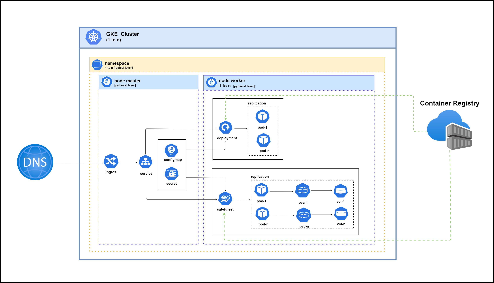

🚀 **Google Kubernetes Engine (GKE) Best Practice**

# 1. The Historical From Borg to Kubernetes

The foundation of Google Kubernetes Engine (GKE) is deeply rooted in Google's internal, secret system called Borg. Since the early 2000s (around 2003–2004), Google utilized Borg to manage billions of critical application containers (like Search and Gmail) efficiently across their massive fleet of servers.

Why Borg Was Created? Managing thousands of machines and applications manually was simply impossible. Therefore, Borg was engineered to automate:
    a. Scaling: Automatically adjusting the number of resources an application needed.
    b. Self-Healing: If a server or application failed, Borg automatically moved and restarted the workload elsewhere without human help.
    c. Efficiency: Ensuring servers were used to their maximum capacity to save costs.

Google knew that other companies faced the same container problems they did. So, in 2014, Google chose to share their solution globally.

Instead of releasing the secret Borg system, they created a new, public project called Kubernetes. Kubernetes uses all the smart ideas and lessons Google learned from running Borg.

Why They Made It: Google built Kubernetes to be the standard way to manage containers. This had two main benefits:
    Works Everywhere (Portability): Your container apps can run easily on any cloud or your own computer system.
    No Vendor Lock-in: You are free to switch between different cloud companies without trouble.

In short, Borg was Google's secret, internal blueprint, and Kubernetes is the simplified, open-source realization of that blueprint, which eventually led to the commercial service GKE.

# 2. When Should You Use Kubernetes?

You should think about using Kubernetes (K8s) when you have many container-based applications and need strong automation to manage them easily.

Condition That Suggests Using, Why K8s Helps:

1. Need to Scale,
   "When your app often has sudden changes in traffic (like many users at once), and you need resources to be added or removed automatically and fast."
2. High Availability,
   "When your app must almost never stop working. K8s automatically sees failed containers and moves them to healthy servers, keeping your app running."
3. Managing Microservices,
   "When you break one big app into many small services. K8s is excellent at managing how all these small services talk to each other.""
4. Efficient Resource Use 
   "When you want to ensure your servers are used as much as possible to save infrastructure costs"
5. Fast and Safe Updates,
   "When your team needs to release new app versions quickly and safely (like Rolling Updates), and easily switch back (rollback) if something goes wrong."
6. Hybrid or Multi-Cloud Needs
   "When you need to run the exact same app on public clouds (AWS, Azure, GCP) and your own local data center."
   
If you only run one or two small apps, Kubernetes might be too complex. K8s is worth it when the complexity of your applications and your need for automation become too much to handle by hand.

# 3. Architectural Best Practice

ubernetes is a very powerful platform, but using it correctly requires the right strategy. Below are the recommended guides and best practices for managing your cluster and applications in Kubernetes efficiently, securely, and sustainably

## 3.1 External Services (The Doors and Supplies)

These components live outside the cluster but are crucial for its operation.

| Component           | Simple Description                                                                 | Key Function                                                        |
|---------------------|-----------------------------------------------------------------------------------|---------------------------------------------------------------------|
| DNS                 | The system that translates website names (like myapp.com) into computer IP addresses. | Guides external user traffic to the cluster's main entrance (Ingress). |
| Container Registry  | The central storage location (warehouse) for all application blueprints (container images like Docker images). | Stores the software images that the Worker Nodes pull when they need to start a new Pod. |

## 3.2 Namespace

A virtual way to divide the cluster's resources into separate, isolated rooms.
Helps organize and separate teams or projects running on the same cluster (e.g., separating the env dev, env testing).

## 3.3 Node Master

This is the management layer that decides where things should run and keeps the cluster in the desired state.

| Component   | Simple Description                                                                 | How It Works                                                                 |
|-------------|------------------------------------------------------------------------------------|------------------------------------------------------------------------------|
| Ingress     | The main traffic controller that manages external HTTP/HTTPS access to services inside the cluster. | Directs incoming external requests to the correct internal Service based on the website address or path. |
| Service     | A stable, internal address that groups a set of similar Pods.                      | Acts as an internal Load Balancer, forwarding requests to healthy Pods without the user needing to know their specific location. |
| ConfigMap   | An object used to store non-sensitive configuration data (settings) for applications. | Provides configuration details (like environment variables) to the Pods that need them. |
| Secret      | An object used to store sensitive data securely, such as passwords or API keys.     | Delivers secure credentials to applications running in Pods.                  |
| Namespace   | A virtual way to divide the cluster's resources into separate, isolated rooms.      | Helps organize and separate teams or projects running on the same cluster (e.g., separating the production environment from testing). |

## 3.4 Node Worker

These are the machines where your applications actually run.

### 3.4.1 Workloads and Scaling

| Component     | Simple Description                                                        | Key Function & Relationship                                                |
|---------------|--------------------------------------------------------------------------|----------------------------------------------------------------------------|
| Pod           | The smallest, basic running unit. It holds one or more containers that work together. | Runs a single instance of your application. Everything in Kubernetes focuses on scheduling and managing Pods. |
| Deployment    | An object that manages how updates and rollbacks are done for your application. | Ensures that the desired number of Pods is always running and handles the process of updating your app version gracefully. |
| ReplicaSet    | The mechanism that guarantees a specific, stable number of identical Pods are always available. | Constantly monitors the Pods and immediately replaces any Pod that fails or crashes. |
| StatefulSet   | Used for managing applications that require a unique identity and permanent storage (like databases). | Ensures a fixed order of deployment and gives each Pod its own specific name and dedicated storage. |

### 3.4.2 Data Storage

| Component              | Simple Description                                                        | Purpose                                                                  |
|------------------------|----------------------------------------------------------------------------|--------------------------------------------------------------------------|
| PersistentVolume (PV / vol 1)  | The actual piece of storage hardware (like a cloud disk) made available to the cluster. | Provides storage that lasts longer than a Pod. The data stays safe even if the application Pod is deleted. |
| PersistentVolumeClaim (PVC) | A developer's request for storage (e.g., "I need 10GB of fast storage"). | Acts as a claim that links a Pod to an available PV.                     |
